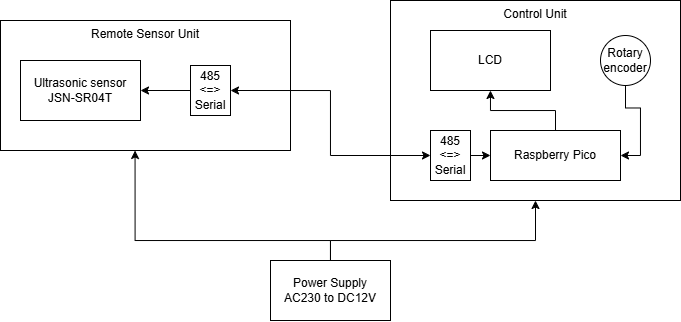

# Projekt Studna
> Se skládá ze 2 nezávislých částí
> - Ochrana domácí vodárny
> - Měření výšky hladiny

## Ochrana domácí vodárny
Do studny je umístěn hladinový spínač, který sepne při kriticky nízké hladině. Tím se odpojí (3 fázová) domácí vodárna, aby se systém nezavzdušnil a čerpadlo neshořelo. [Schema v rozvaděči](./HW/Silnoproud_ochrana_cerpadla/darling_ochrana.pdf)

## Měření výšky hladiny
Motivace:
- Do studny byl při rekonstrukci zaveden UTP kabel. 
- Pramen není příliš silný v letních měsících je třeba šetřit vodou.

Snaha byla o levné řešení, hlavně na straně senzoru, které v případě nefunkčnosti bude možné snadno upgradovat na "profi drahé" řešení.
Levné řešení (cena 10USD) je ultrazvukový modul více níže.
Drahé řešení je např. [hydrostatický snímač TSH-37](https://www.fiedler.company/sites/default/files/dokumenty/datasheet_tsh37.pdf) jeho cena (v roce 2025) je cca 8.000Kč.

Pro obě řešení zůstane stejná komunikace mezi senzorem a řídící jednotkou a to přes RS485. TSH-37 vyžaduje protokol Modbus RTU na což není SW momentálně připraven.

### Zobrazovací a řídicí jednotka 
Základní bloky:
- modul 485
- Raspberry Pico
- LCD 128x64

[Schema řídící jednotky](./HW/kicad/lcd/lcd.pdf)

### Ultrazvukové čidlo
Waterproof Ultrasonic Module JSN-SR04T
[zajímavostí o modulu (schema a módy)](https://forum.mysensors.org/topic/11417/jsn-sr04t-distance-sensor-reliability-issue-fix/6)

**Limity a omezení**, __které možná ovlivní vaše rozhodnutí o jeho nepoužití__.
- Měřený rozsah je přibližně od 25cm do 230cm.
- Přesnost je **kvantována v krocích 1,7cm**.

Tyto limity se nedají v softwaru řídící jednotky nijak kompenzovat, jsou dány konstrukcí modulu JSN-SR04T.

Možné příčiny limitů:
- **"Kvantování"**: zvuk se ve vzduchu šíří přibližně rychlostí 343 m/s. Když se podíváme, jak daleko zvuk urazí za 1 mikrosekundu:

$$
d = v \cdot t = 343 \text{m/s} \cdot 1 \mu s = 0{,}000 343 \text{m} = 0{,}0343 \text{cm}
$$

Jelikož vzdálenost se měří tam i zpět, a nás zajímá jen cesta tam, **čas se dělíme dvěma**,a to znamená, že rozlišení senzoru závisí na **časovém rozlišení** měření:

Např. pokud vnitřní časovač v modulu meří s přesností 100µs, pak bude kvantovací krok:

$$
0{,}0343 \text{cm} \cdot 100 \mu \cdot \frac{1}{2} \approx 1{,}7 \text{cm}
$$
Myslím, že modul JSN-SR04T vyhodnocuje či vzorkuje echo s frekvencí cca 10kHz, tedy žádná sláva a odtud plyne nepřesnost.

- Ve vzdálenosti < než 25cm se nestačí odražené echo detekovat.
- Ve vzdálenosti > než cca 230cm či vyšší vnitřní čítač přeteče a modul vrátí maximální hodnotu. Pokud se žádné echo nevrátí (detektor míří do volného prostoru) maximální hodnota bývá v intervalu (230,250) cm. S jistou rezervou je měření validní **do 220 cm**.

#### Použitý mód JSN-SR04T
se měmí hodnotou rezistoru viz datasheet; Mode 3: Mode=120K (or short M2 bit directly) UART controlled output
The UART controlled output method outputs the measured distance value (hexadecimal number)
according to the UART communication format. In this method, the trigger command 0X55 signal
needs to be added to the RX pin. The module measures once every time the command is received. The foot outputs the measured
distance value. The command trigger cycle should be greater than 60ms

#TODOs & BUGs

- HW
 - PCB layout:
  - opravit všechna poudra tranzistorů; Momentálně se dá deska osadit, ale všechny tranzistory se musí debilně otočit o 120stupňů.
  - posunout kondenzátor C7; usnadní se montáž
 - přidat STL model krabičky
		
	
   